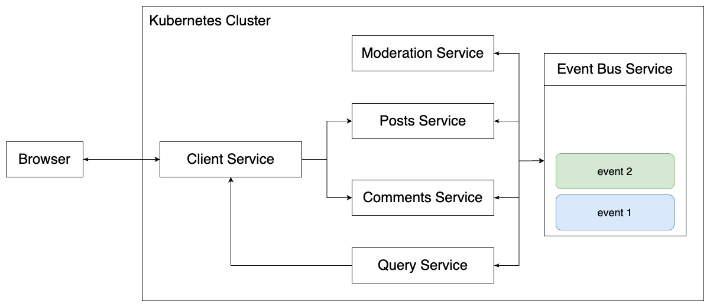

# Blog
## Description
This is a simple blog web application I developed for learning purposes. It supports the following features.
* Post creation/editing/deletion
* Commenting on posts
* Comment moderation

## App Overview
The blog app is a microservices application comprised of small, independent services. Six services run in the background: Client, Posts, Comments, Moderation, Query, and Event Bus. They are deployed in a Kubernetes cluster, and the ingress controller handles load-balancing traffic from the outside world to each service. Since the app follows a microservices architecture, these services do not communicate directly; instead, they collaborate based on events emitted whenever a service performs a task.

### Client service
The Client service provides the React app, which communicates with other services based on user actions. For example, when a user clicks the 'Submit' button for post creation, it sends an HTTP POST request to the Posts service.

### Posts service
The Posts service is responsible for post creation, editing, and deletion. It maintains its own MongoDB database and stores all created posts. Whenever a post is created, edited, or deleted, the service emits a corresponding event, such as PostCreated, PostEdited, or PostDeleted. These events are then sent to the Event Bus service, which in turn relays them to the Query Service for handling.

### Comments service
The Comments service is responsible for comment creation. It maintains its own MongoDB database and stores all created comments. When a new comment is inserted into the database, the service emits a CommentCreated event. Subsequently, the comment undergoes a moderation step. After the moderation process is completed, the Moderation service notifies the Comments service. The Comments service then handles the event based on the outcome of the moderation. Finally, it informs the Query service to update the comments.

### Moderation service
The Moderation service is responsible for moderating newly created comments. You can predefine a list of NG words, and the service checks if a comment contains any of these NG words. If it finds an NG word in a comment, it sets the status of that comment to 'rejected.' The React app does not display comments with a 'rejected' status.

### Query service
The Query service is responsible for storing both posts and comments together. Without this service, the React app would need to send individual requests to the Posts and Comments services for each post and comment, which is highly inefficient. To address this problem, the Query service maintains its own database where it stores all posts and comments. This enables the React app to make a single request to retrieve them. Furthermore, if either the Posts or Comments service experiences downtime for any reason, the app can still display posts and comments because the Query service has a complete record of them.

### Event Bus service
The Event Bus service acts as a mediator, transforming events from senders to receivers. All events emitted by the other services are first sent to this service and then relayed to the other services to notify them of event occurrences.
